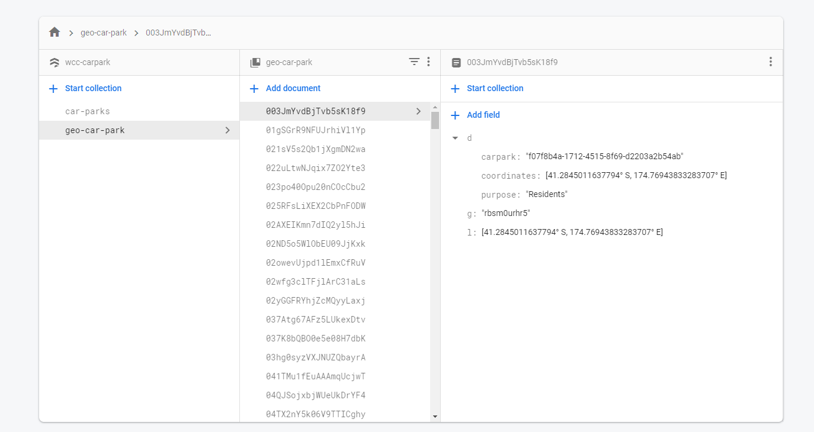

# WCC Disabled Car Parking Service
[](https://app.circleci.com/pipelines/github/Harmannz/parking-finder)

Project to help find nearby car parks in Wellington greater area.

## MVP

MVP is to restrict the parking to just disabled car parks.

# Data Processing

The car parks dataset sourced from [WCC Open Data](https://data-wcc.opendata.arcgis.com/datasets/a1ec0e82e8c2471b97607bd7e08622b5_0) contains car parking data and nztm coordinates.

Because our plan is to use GeoFirestore to find car parks near a location. 
The firebase data model is to separate geo-location information with static data about cars. This will help performance when app pulls in nearby car parks.

 
## Step 1. Convert NZTM to lat long

The WCC dataset uses nztm to represent parking location. This needs to be converted to lat long to upload to firebase.

[nztm/src/nztm_to_geod.py](data/preparation/nztm/src/nztm_to_geod.py) will convert the x and y nztm coordinates to lat long.

python3 
```bash
python3 nztm_to_geod.py ../../data_processing/data/car_parks_wellington.csv \
-o ../../data_processing/data/car_park_lat_long.csv
```

or docker

```$bash
cd nztm/src/

docker build -t park:latest . && \
docker run --rm \
--mount type=bind,source=$(pwd)/sample,target=/home/sample \
park:latest \
/home/sample/example.csv -o /home/sample/out.csv
```

This script will create a csv file that can be uploaded to geofirestore.

I have exported wcc data in [firebase/data](firebase/data).

## Step 2. Upload to geolocation to GeoFirestore 

I am using [GeoFirstore-JS](https://github.com/MichaelSolati/geofirestore-js/blob/master/README.md) library.

Due to the nature of the GeoFirestore data structure, the data needs to be inserted by GeoFirestore js library in order to be able to query it later. 
Thus the data is inserted into firebase via node scripts found in [firebase](firebase).  

To get started you need to create a firebase project and download serviceAccount json file. Follow relevant firebase guides to do this.

Inserting geofire data is done by the [geofire_upload.js](firebase/src/geofire_upload.js).

First run `npm install`, then

```bash
node geofire_upload.js \
--file ../data/car_park_lat_long.csv \
--creds serviceAccount.json
```

Run `geofire_upload.js --help` for help on cli arguments

## Step 3. Upload to car park data to Firestore

Uploading car parks data is also done via node script [firestore_upload.js](firebase/src/firestore_upload.js). This script sanitizes WCC car park data, mainly to remove redundant fields, then uploads data to firestore. 

```bash
node firestore_upload.js \
--file ../data/car_parks_wellington.csv \
--creds serviceAccount.json
```

Run `firestore_upload.js --help` for help on cli arguments

At the end you should have two collections, one containing documents on car parks and other containing documents on car park's geographic location.



# Location-based querying

We can now query car parks based on location and radius.

```javascript
const { GeoFirestore } = require('geofirestore');
const admin = require('firebase-admin');

// Initialise app
admin.initializeApp({
    credential: admin.credential.cert(serviceAccount)
});

// Get reference to firestore
let ref = admin.firestore();
const geofirestore = new GeoFirestore(ref)

// Create a GeoQuery based on a location
const geocollection = geofirestore.collection('geo-car-park')
const query = geocollection.near({ center: new admin.firestore.GeoPoint(-41, 174), radius: 1000 });

// Get query (as Promise)
query.get().then((value) => {
    value.docs.forEach(point => console.log(point.data()))
});

```